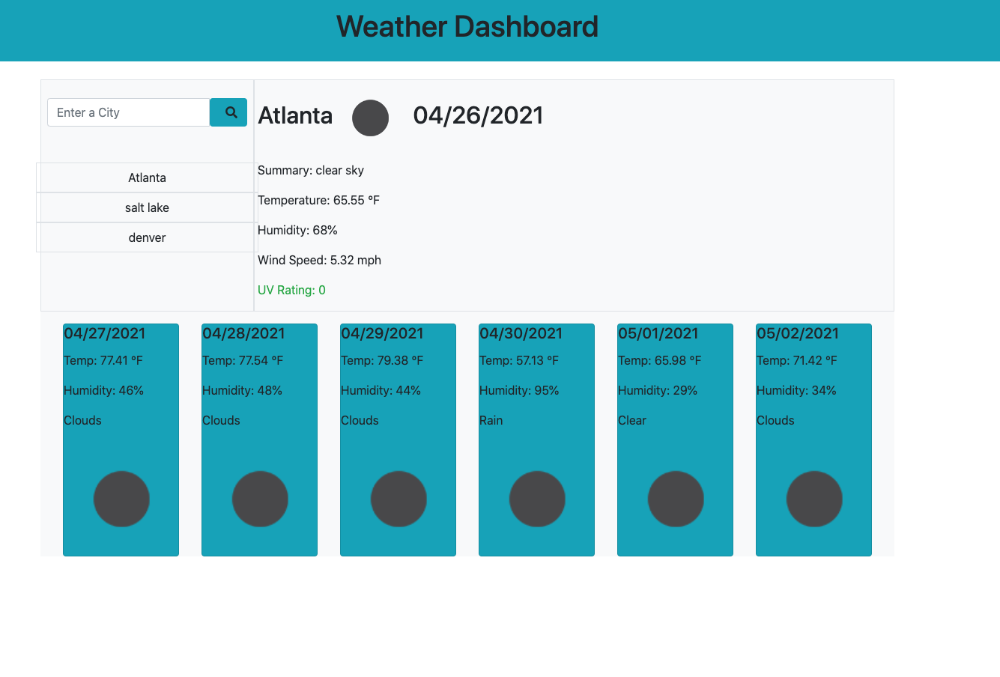

# WeatherDashboard
This is a Weather Dashboard App that was made using the user story below:

* AS A traveler
* I WANT to see the weather outlook for multiple cities
* SO THAT I can plan a trip accordingly

# Features
* Search for a city
* View current and future conditions for that city and that city is added to the search history
* UV Index shows if conditions are favorable, moderate or dangerous.
* 5-day forecast that displays the date, an icon representation of weather conditions, the temperature, and the humidity
* The app will saved the last searched city forecast on your web browser. 

# Technology Used
* Jquery 
* Bootstrap
* HTML CSS 

# WebApp Screenshot
